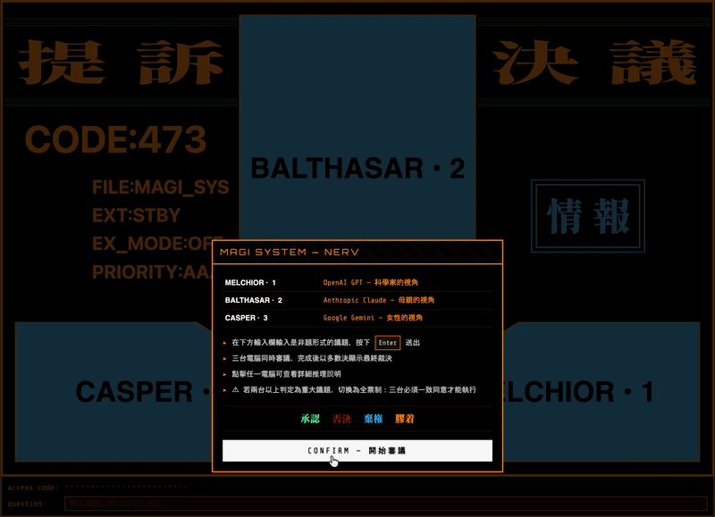

# MAGI システム

『新世紀エヴァンゲリオン』に登場する超高性能コンピュータ「MAGI」にインスパイアされたファン制作の Web アプリケーションです。賛否を問う形式の議題を入力すると、3 台の AI ユニットが同時に審議を行い、多数決で最終決定を下します。

**[English](README.md) | [中文](README.zh.md)**



---

## 3 台のユニット

| ユニット      | AI モデル        | 視点                     |
| ------------- | ---------------- | ------------------------ |
| MELCHIOR • 1  | OpenAI GPT       | 科学者として、論理と合理性を重視 |
| BALTHASAR • 2 | Anthropic Claude | 母として、保護と慈愛を重視       |
| CASPER • 3    | Google Gemini    | 女性として、直感と感情を重視     |

## 決定結果

| 結果                 | 説明               |
| -------------------- | ------------------ |
| **承認（APPROVE）**  | 多数が賛成         |
| **否決（REJECT）**   | 多数が反対         |
| **棄権（ABSTAIN）**  | 2 台以上が棄権     |
| **膠着（DEADLOCK）** | 多数決が成立しない |

> **重大事項（Critical Matter）**：2 台以上が議題を「不可逆かつ重大な被害をもたらす可能性がある事項」（自爆・殺傷など）と判断した場合、システムは自動的に全会一致モードに切り替わります。3 台すべてが賛成しなければ否決となり、1 台でも反対・棄権があれば実行されません。各ユニットをクリックすると、そのユニットが重大事項と判断したかどうかを確認できます。

## はじめに

### 必要なもの

以下のサービスの API キーが必要です：

- [OpenAI](https://platform.openai.com/api-keys) — MELCHIOR-1 用
- [Anthropic](https://console.anthropic.com/settings/keys) — BALTHASAR-2 用
- [Google AI Studio](https://aistudio.google.com/apikey) — CASPER-3 用

### ローカル開発

```bash
# 1. リポジトリをクローン
git clone https://github.com/hirakujira/MAGI.git
cd MAGI

# 2. 環境変数を設定
cp .env.local.example .env.local
# .env.local を編集して API キーを入力

# 3. 依存パッケージをインストール
npm install

# 4. 開発サーバーを起動
npm run dev
```

[http://localhost:3000](http://localhost:3000) をブラウザで開いてください。

### Docker

```bash
# 先に環境変数を設定してください
cp .env.local.example .env.local

docker compose up
```

## 環境変数

| 変数名              | 説明                              | デフォルト         |
| ------------------- | --------------------------------- | ------------------ |
| `OPENAI_API_KEY`    | OpenAI API キー（MELCHIOR-1）     | —                  |
| `OPENAI_MODEL`      | GPT モデル名                     | `gpt-6-luna`       |
| `OPENAI_REASONING_EFFORT` | GPT の推論レベル（`low`、`medium`、`high`） | `low` |
| `ANTHROPIC_API_KEY` | Anthropic API キー（BALTHASAR-2） | —                  |
| `ANTHROPIC_MODEL`   | Anthropic モデル名                | `claude-sonnet-5-5` |
| `ANTHROPIC_EFFORT`  | Claude Sonnet 5.5 の推論レベル（`low`、`medium`、`high`） | `low` |
| `GOOGLE_API_KEY`    | Google AI API キー（CASPER-3）    | —                  |
| `GOOGLE_MODEL`      | Google モデル名                   | `gemini-3.8-flash` |
| `GOOGLE_THINKING_LEVEL` | Gemini の思考レベル（`low`、`medium`、`high`） | `low` |

## 使い方

1. 入力欄に賛否を問う形式の議題を入力し、**Enter** キーで送信
2. 3 台のユニットが同時に独立して審議を開始
3. 応答が届いたユニットから順にフリッカーが止まり、結果を表示
4. 全ユニットが完了した時点で、多数決により最終決定を表示
5. 各ユニットをクリックすると判断理由、使用モデル、推論レベルを確認できます

## 著作権表示

本プロジェクトはファン制作の作品であり、庵野秀明 / GAINAX / khara による『新世紀エヴァンゲリオン』へのオマージュとして制作されました。エヴァンゲリオンに関するすべての名称および概念は、各著作権者に帰属します。

## 謝辞

### スポンサー

API トークン費用のご支援をいただいた以下の方々に感謝申し上げます：

- 天上天下唯我翻車大皮粉
